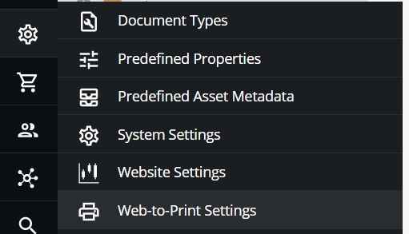

[](https://github.com/ddev/ddev-pdfreactor/actions/workflows/tests.yml) 

## What is ddev-pdfreactor?

This repository allows you to quickly install [PDFreactor](https://www.pdfreactor.com/) into a [DDEV](https://ddev.readthedocs.io) project using just `ddev get ddev/ddev-pdfreactor`.

## Installation

1. `ddev get ddev/ddev-pdfreactor`
2. `ddev restart`

## Explanation

This PDFreactor recipe for [DDEV](https://ddev.readthedocs.io) installs a [`.ddev/docker-compose.pdfreactor.yaml`](docker-compose.pdfreactor.yaml) using the [`realobjects/pdfreactor`](https://hub.docker.com/r/realobjects/pdfreactor/) Docker image.

## Interacting with PDFreactor

* The PDFreactor instance will listen on TCP port 9423 (the PDFreactor default).
* Configure your application to access PDFreactor on the host:port `pdfreactor:9423`.

## Example to use this PDFreactor service with the official PDFreactor Web Service PHP client

```php
<?php
// Include PDFreactor class
// You can download the PDFreactor Web Service PHP client from:
// http://www.pdfreactor.com/download/get/?product=pdfreactor&type=webservice_clients&jre=false
require_once('PDFreactor.class.php');
use com\realobjects\pdfreactor\webservice\client\PDFreactor;
use com\realobjects\pdfreactor\webservice\client\PDFreactorWebserviceException;
// Create new PDFreactor instance
$pdfReactor = new PDFreactor('http://pdfreactor:9423/service/rest');

$config = [
    // Specify the input document
    'document'=> 'http://www.pdfreactor.com/product/samples/textbook/textbook.html',
];

// Render document and save result to $result
$result = null;
try {
    $result = $pdfReactor->convertAsBinary($config);
    header('Content-Type: application/pdf');
    echo $result;
} catch (PDFreactorWebserviceException $e) {
    echo '<h1>An Error Has Occurred</h1>';
    echo '<h2>' . $e->getMessage() . '</h2>';
}
```

More info: [https://www.pdfreactor.com/php/](https://www.pdfreactor.com/php/)

## Example: Use PDFreactor service with Pimcore

1. Install Pimcore demo
```
mkdir -p pimcore-demo
cd pimcore-demo
ddev config --project-type=php --docroot=public --webserver-type=apache-fpm --php-version=8.0 --database=mariadb:10.5
ddev composer create -y -n pimcore/demo
ddev exec php vendor/pimcore/pimcore/bin/pimcore-install --admin-username admin --admin-password demo --mysql-host-socket db --mysql-username db --mysql-password db --mysql-database db --no-interaction
```
2. Install ddev-pdfreactor Addon
```
ddev get ddev/ddev-pdfreactor
ddev restart
```
3. Config
    1. When you have a PDFreactor license key you can add this to `.ddev/pdfreactor/licensekey.txt`
    2. Login to the admin interface https://pimcore-demo.ddev.site/admin (Username: admin, Password: demo)
    3. Go to the Web2Print settings

    

    4. Set the config and click the save button

    | Setting  | Value                         |
    |----------|-------------------------------|
    | Tool     | PDFreactor                    |
    | Protocol | http                          |
    | Server   | pdfreactor                    |
    | Port     | 9423                          |
    | BaseURL  | http://pimcore-demo.ddev.site |

4. Test a Print document
   1. Execute Maintenance Worker:

      `ddev php bin/console messenger:consume pimcore_core pimcore_maintenance`

   3. Go to the demo Print catalog (/print/Demo-Catalog)
   4. Click to "Generate PDF" button

## License

ddev-pdfreactor is distributed under the [Apache 2.0 license](LICENSE).

**Contributed and maintained by [@blankse](https://github.com/blankse)**
